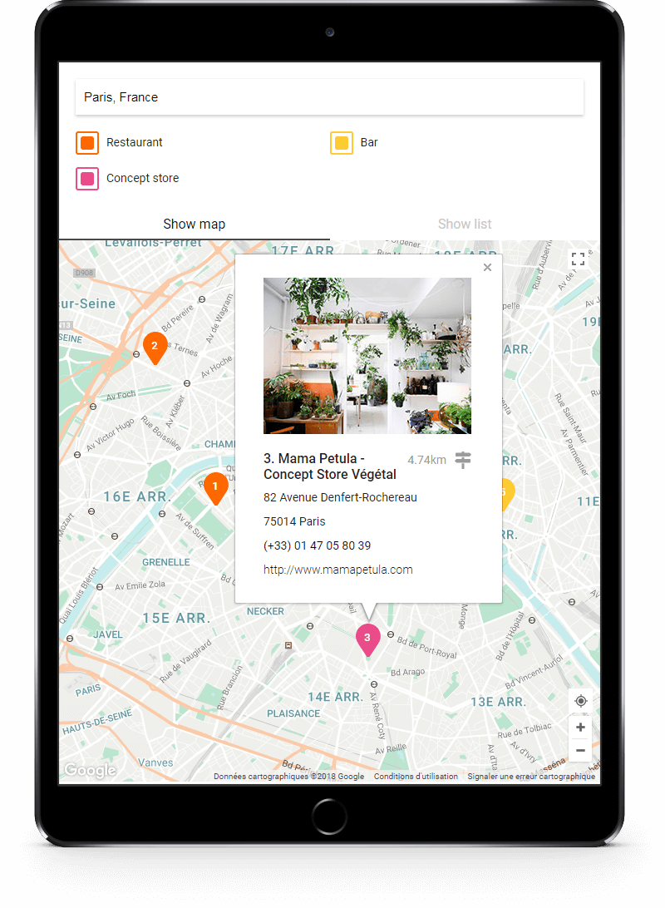
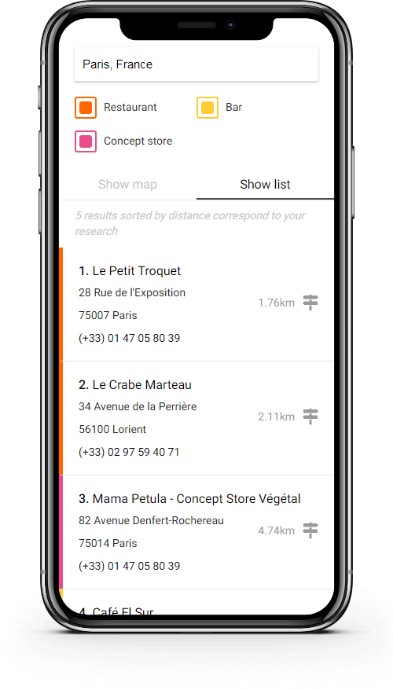

title: Features - Storelocator.js
description: The Storelocator is responsive and includes many features such as autocomplete, geolocation, markers with infoWindow and clusters. Markers can be filtered

### Responsive design

The Storelocator is responsive mobile first and can be customized with just a few CSS rules.

<center class="wrapper-screenshot-touch">

</center>

### Maps options

The map can be customized with a configuration object in the `map.options.styles` property. Use for example <a href="https://snazzymaps.com/" title="Snazzy Maps" target="_blank">Snazzy Maps</a> tools to generate a JSON configuration, and paste it in the constructor key `map.options.styles`.

Below, an example of configuration:

```json
{
    "styles": [{"featureType":"administrative","elementType":"labels.text.fill","stylers":[{"color":"#6195a0"}]},{"featureType":"administrative.province","elementType":"geometry.stroke","stylers":[{"visibility":"off"}]},{"featureType":"landscape","elementType":"geometry","stylers":[{"lightness":"0"},{"saturation":"0"},{"color":"#f5f5f2"},{"gamma":"1"}]},{"featureType":"landscape.man_made","elementType":"all","stylers":[{"lightness":"-3"},{"gamma":"1.00"}]},{"featureType":"landscape.natural.terrain","elementType":"all","stylers":[{"visibility":"off"}]},{"featureType":"poi","elementType":"all","stylers":[{"visibility":"off"}]},{"featureType":"poi.park","elementType":"geometry.fill","stylers":[{"color":"#bae5ce"},{"visibility":"on"}]},{"featureType":"road","elementType":"all","stylers":[{"saturation":-100},{"lightness":45},{"visibility":"simplified"}]},{"featureType":"road.highway","elementType":"all","stylers":[{"visibility":"simplified"}]},{"featureType":"road.highway","elementType":"geometry.fill","stylers":[{"color":"#fac9a9"},{"visibility":"simplified"}]},{"featureType":"road.highway","elementType":"labels.text","stylers":[{"color":"#4e4e4e"}]},{"featureType":"road.arterial","elementType":"labels.text.fill","stylers":[{"color":"#787878"}]},{"featureType":"road.arterial","elementType":"labels.icon","stylers":[{"visibility":"off"}]},{"featureType":"transit","elementType":"all","stylers":[{"visibility":"simplified"}]},{"featureType":"transit.station.airport","elementType":"labels.icon","stylers":[{"hue":"#0a00ff"},{"saturation":"-77"},{"gamma":"0.57"},{"lightness":"0"}]},{"featureType":"transit.station.rail","elementType":"labels.text.fill","stylers":[{"color":"#43321e"}]},{"featureType":"transit.station.rail","elementType":"labels.icon","stylers":[{"hue":"#ff6c00"},{"lightness":"4"},{"gamma":"0.75"},{"saturation":"-68"}]},{"featureType":"water","elementType":"all","stylers":[{"color":"#eaf6f8"},{"visibility":"on"}]},{"featureType":"water","elementType":"geometry.fill","stylers":[{"color":"#c7eced"}]},{"featureType":"water","elementType":"labels.text.fill","stylers":[{"lightness":"-49"},{"saturation":"-53"},{"gamma":"0.79"}]
}
```

### Autocomplete

Storelocator include by default [Google Maps Autocomplete](https://developers.google.com/maps/documentation/javascript/places-autocomplete). The `places` librairy is automatically loaded.

### Geolocation

Storelocator integrate its own geolocation button `.storelocator-geolocButton` to trigger a geolocation request.

!!! warning
    Geolocation need SSL certificat with `https` on Google Chrome and somes others recents browsers.<br />More information <a href="https://developers.google.com/web/updates/2016/04/geolocation-on-secure-contexts-only" title="HTML5 Geolocation API">here</a>.

### Filters

The storelocator can be used with or without filters. Filters let you filter store by categories. Store categories can be unlimited but **must be unique** for each marker. Identifie them by a unique ID in the JSON key `categories` as string format.

### Fetch requests

All search requests use the fetch API to communicate with the Node.js server. Datas are transmitted by JSON format.

### Markers

Marker have a default style, the same as on Google Maps. Storelocator has an option to easily customized the style of the marker with a SVG.

To use this feature, fill the option `map.markers` as below:

```json
{
    "map": {
        "markers": {
            "width": 30,
            "height": 40,
            "styles": [{
                "category": "userPosition",
                "colorBackground": "#4285f4",
                "colorBorder": "#4285f4"
            }, {
                "category": "1",
                "colorBackground": "#ec4233",
                "colorBorder": "#ec4233"
            },{
                "category": "2",
                "colorBackground": "#009925",
                "colorBorder": "#009925"
            },{
                "category": "3",
                "colorBackground": "#eeb211",
                "colorBorder": "#eeb211"
            }]
        }
    }
}
```

??? info "Data types"
    * `width` - {Int}
    * `height` - {Int}
    * `category` - {String}
    * `colorBackground` - {String}
    * `colorBorder` - {String}

You can change the marker dimensions (width and height) in pixel by passing an integer.

`map.markers.style` contains object, each objects correspond to a marker category, with 4 parameters:

!!! tip "Category reserved"
    The marker category __`userPosition`__ allow you to customized the marker style of the user geolocation. Do not change the category of this marker.<br /><br />

!!! bug "Marker SVG on IE"
    Internet Explorer doesn't accept custom SVG for markers. Default markers are use on this browser.

### Clusters

!!! warning "Load the librairy"
    With cluster option enabled, you need to load `./js/libs/markerclusterer.js` separately in your vendors.<br />The library is included in the package.

Cluster options are available, please read the <a href="https://googlemaps.github.io/js-marker-clusterer/docs/reference.html" target="_blank" title="Documentation">documentation here</a>.

The default image is provided by <a href="https://developers.google.com/maps/documentation/javascript/examples/markerclusterer/m1.png" title="Cluster image" target="_blank">Google</a>. See the example below:

```json hl_lines="7"
{
    "cluster": {
        "status": true,
        "options": {
            "gridSize": 50,
            "maxZoom": 13,
            "imagePath": "https://developers.google.com/maps/documentation/javascript/examples/markerclusterer/m",
            "zoomOnClick": true,
            "averageCenter": true,
            "minimumClusterSize": 2
        }
    }
}
```

??? info "Data types"
    * `imagePath` - {String}
<br />

Default image can be changed, fill the option `cluster.options.styles` as below, to easily customized the style of the cluster with a PNG image (included in the project):

```json hl_lines="10 11 12 13 14 15"
{
    "cluster": {
        "status": true,
        "options": {
            "gridSize": 50,
            "maxZoom": 13,
            "zoomOnClick": true,
            "averageCenter": true,
            "minimumClusterSize": 2,
            "styles": [{
                "url": "/images/cluster.png",
                "textColor": "#000",
                "width": 60,
                "height": 60
            }]
        }
    }
}
```

??? info "Data types"
    * `url` - {String}
    * `textColor` - {String}
    * `width` - {Int}
    * `height` - {Int}


### Markers update on bounds changed

The map can be refreshed when user moves or the zoom changes. To use this feature, enable options `updateMarkerOnBoundsChanged.status`. Default parameters are optimized but you can easily change them.<br />The functionality is automatically disabled when marker info Window is opened, to prevent marker removed.

!!! tip "Debug overlay"
    Enable `debug` option to see debug overlay above the map:

    * `green` - Limit the number of markers in the viewport `maxMarkersinViewportLimit`. Map is centered on this viewport
    * `red` - Viewport contains all markers related to the `searchRadius`. User can move on this area without refresh the map.

### Results

List of results are synchronized with markers. The list is filtered by category and store are sort by distance to the map center.
A small ES6 template string is use to built the HTML of each result.

```html
<div class="storelocator-detailStore">
    <span class="storelocator-detailStoreTitle">{title}</span>
    <span class="storelocator-detailStoreDistance"><a href="http://www.google.fr/maps/dir/{origin}/{destination}" title="Itinerary" target="_blank">{distance}km</a></span>
    <span class="storelocator-detailStoreAddress">{address}</span>
    <span class="storelocator-detailStoreZipcode">{zipcode}</span>
    <span class="storelocator-detailStoreCity">{city}</span>
    <span class="storelocator-detailStorePhone"><a href="tel:{phone}" title="Call">{phone}</a></span>
</div>
```

!!! info "Distance"
    You will notice that the distance information is caculate in backend with the PHP class. The value is not present in the original JSON.

### InfoWindow

Storelocator allow you to show more information of the marker when user click on it. It uses the native Google Maps infoWindow with a small ES6 template string to built the HTML of the info window.

```html
<div class="storelocator-infoWIndow">
    <span class="store-picture">><a href="{link}" title="Visit website" target="_blank"></a></span>
    <div class="storelocator-detailStore">
        <span class="storelocator-detailStoreTitle">{title}</span>
        <span class="storelocator-detailStoreDistance"><a href="http://www.google.fr/maps/dir/${origin}/${destination}" title="Itinerary" target="_blank">{distance}km</a></span>
        <span class="storelocator-detailStoreAddress">{address}</span>
        <span class="storelocator-detailStoreZipcode">{zipcode}</span>
        <span class="storelocator-detailStoreCity">{city}</span>
        <span class="storelocator-detailStorePhone"><a href="tel:{phone}" title="Call">{phone}</a></span>
        <span class="store-link"><a href="{link}" title="Visit website" target="_blank">{link}</a></span>
    </div>
</div>
```

!!! info "Distance"
    You will notice that the distance information is caculate in backend with the PHP class. The value is not present in the original JSON.

You can easily edit the CSS to customized the style of the infoWindow.

Info window contains:

* Marker information
* Distance between search position/user position and marker position
* Link to Google Maps itinerary

### Loader

Storelocator integrate a small loader, visible during request on the top of the map. The display is trigger with a `.active` CSS class add to `.storelocator-loader`.

Structure of the loader:

```html
<div class="storelocator-loader active"></div>
```

### Log message

Storelocator includes log message on requests and errors when `debug` option is enabled. `log` function has two parameters, use it only during development:

* `method` - Choose between `log` and `warn` method of `window.console`
* `message` - The message to show in the console

<script>
  ((window.gitter = {}).chat = {}).options = {
    room: 'store-locator/store-locator'
  };
</script>
<script src="https://sidecar.gitter.im/dist/sidecar.v1.js" async defer></script>