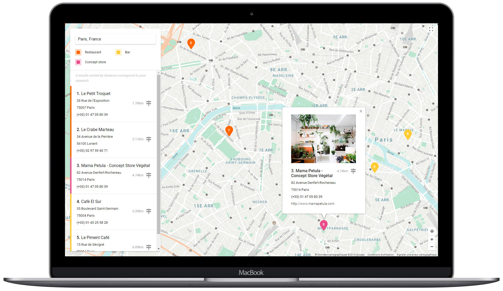

# Storelocatorjs <small>with Google Maps</small>

<strong>Made by developers for developers ♥</strong>
 

Storelocatorjs is a **fast** and **lightweight** Javascript library to easily build a store locator using <a href="https://developers.google.com/maps/documentation/javascript/" target="_blank" title="Documentation">Google Maps API V3</a>. Only **6Kb** on production with gzip, Storelocatorjs has no dependency with any framework or library and is written in **Javascript native**.  

## Github & npm

The library is available as the `storelocatorjs` package name on [Github](https://github.com/yoriiis/storelocatorjs) and [npm](https://www.npmjs.com/package/storelocatorjs). 
If you like the project, like it on Github 😃  
<a class="github-button" href="https://github.com/yoriiis/storelocatorjs" data-icon="octicon-star" data-size="large" data-show-count="true" aria-label="Star yoriiis/storelocatorjs on GitHub">Star</a>

## Browsers support

The project is fully compatible with the most popular web browsers. More information about the Google Maps support on <a href="https://developers.google.com/maps/documentation/javascript/browsersupport?hl=fr" target="_blank" title="Google Maps support">Google Developers</a>. HTML and CSS files are W3C valid.

## Licenses

### Commercial license

If you want to use Storelocatorjs to develop commercial sites, themes, projects, and applications, the Commercial License is the appropriate license. With this option, your source code is kept proprietary.
Purchase a Storelocatorjs Commercial License on the [license page](licenses.html#purchasing).

### Open source license

If you are creating an open source application under a license compatible with the [GNU GPL license v3](https://www.gnu.org/licenses/gpl-3.0.html), you may use Storelocatorjs under the terms of the GPLv3.

[Read more about Storelocatorjs's license](licenses.html)

## Contributors

Created with ♥ by [@yoriiis](http://github.com/yoriiis) 
Many thanks to Cyril CAMBOURNAC for its contribution.

